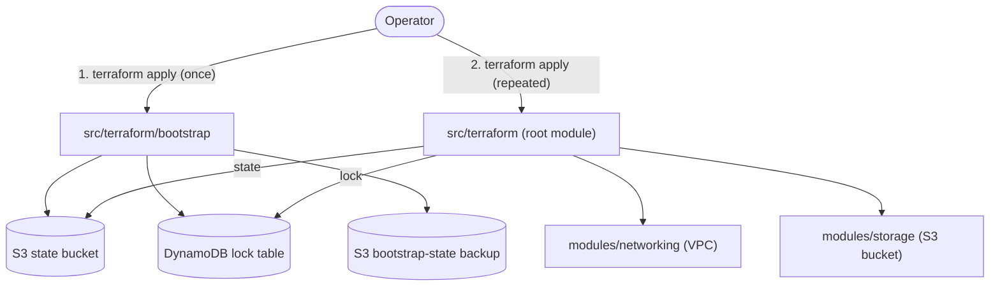

# AWS Infrastructure Template

Polyglot project template where Terraform code lives under `src/terraform/` and the
repo root is reserved for language-agnostic tooling (CI, linters, editor config, AI
instructions, docs).

The example Terraform defines a small AWS stack (a VPC with public/private subnets
and a single S3 bucket) intended as a starting point — replace the modules with
your own resources.

> **Developers**: review [docs/ai-instructions.md](docs/ai-instructions.md) for project structure, coding conventions, and linting rules.

## Architecture

Two-stage Terraform deployment, both under `src/terraform/`:

1. **Bootstrap** (`src/terraform/bootstrap/`) — applied once; provisions the S3
   state bucket, DynamoDB lock table, and a bucket for backing up bootstrap's
   own local-backend state.
2. **Root module** (`src/terraform/`) — calls `modules/networking` and
   `modules/storage`; uses the S3 backend produced by bootstrap.



## Development Setup

The repo pins tool versions via [mise](https://mise.jdx.dev) and manages Python dev
dependencies (currently just `pre-commit`) with [uv](https://docs.astral.sh/uv/).
Common dev tasks are wrapped in the [Makefile](Makefile).

```bash
brew install mise   # macOS · one-time, bootstraps uv + terraform
make lock           # generate uv.lock from pyproject.toml (first time only)
make init-dev-env   # install Python dev deps and enable git hooks
```

Other handy targets:

```bash
make help           # list all targets
make install        # re-sync .venv from uv.lock (after deps change)
make lint           # run all pre-commit hooks against the whole repo
make lock           # regenerate uv.lock after editing pyproject.toml
make terraform-lock # regenerate Terraform lock files for macOS and Linux
```

## Terraform lock files (macOS + Linux)

For the lockfile policy and exact command workflow, see the Terraform section in
[docs/ai-instructions.md](docs/ai-instructions.md#terraform).

## Deploy

```bash
export AWS_PROFILE=<your-profile>

# 1. One-time: provision the state backend — see
#    src/terraform/bootstrap/README.md for the full guide (includes the
#    backend.tf swap that must happen between the two stages).
cd src/terraform/bootstrap
mise exec -- terraform init
mise exec -- terraform apply

# 2. Root module — applied repeatedly
cd ..
mise exec -- terraform init      # (add -migrate-state the first time after swapping to the S3 backend)
mise exec -- terraform apply

# Teardown (root only — leaves bootstrap/state backend intact)
mise exec -- terraform destroy
```

See [docs/ai-instructions.md](docs/ai-instructions.md) for project structure and
conventions, [src/terraform/bootstrap/README.md](src/terraform/bootstrap/README.md)
for the full bootstrap walkthrough, and `.claude/skills/` for AI helper skills
(AWS auth, Terraform via mise, PR description generation, shell script structure).

## Using this as a template

1. Copy the directory contents into a fresh git repo.
2. Replace placeholder values:
   - Project name and description in [pyproject.toml](pyproject.toml) and this
     [README.md](README.md).
   - AWS profile name in [src/terraform/providers.tf](src/terraform/providers.tf) if
     you do not want to rely on `AWS_PROFILE`.
   - SSO constants in [.claude/scripts/aws-sso-credentials.sh](.claude/scripts/aws-sso-credentials.sh)
     if you plan to use it.
3. Adjust the two example modules (`networking`, `storage`) to match the
   resources you actually need.
